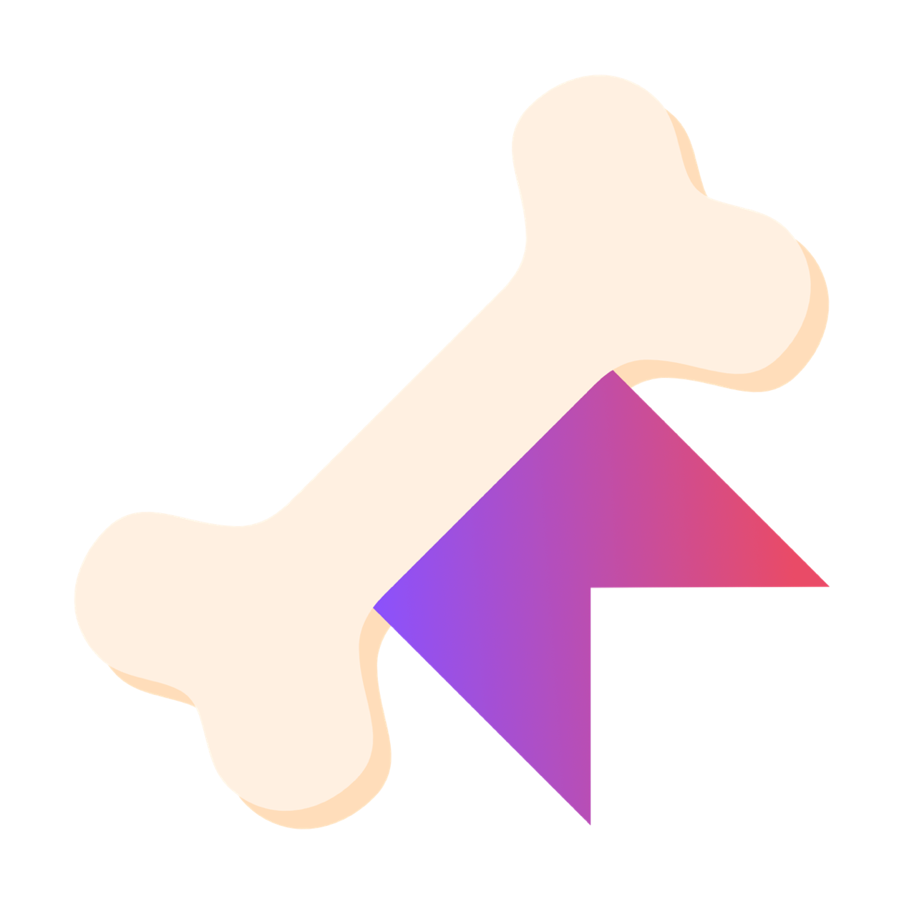

<!--suppress CheckImageSize -->


# Backbone
[](https://github.com/integr-dev/backbone/actions/workflows/ci.yaml)
[](https://github.com/integr-dev/backbone/releases/latest)

[](https://github.com/integr-dev/backbone/blob/master/LICENSE)

Backbone is a powerful and flexible plugin for Spigot-based Minecraft servers, designed to supercharge server customization. Its core philosophy is to enable server administrators and developers to write, test, and update server logic on a live server without requiring restarts, dramatically speeding up the development lifecycle.

Whether you're a server administrator looking to add custom features with simple scripts or a developer prototyping new ideas, Backbone provides the tools you need to be more productive and creative.

## Features

- **Hot-Loadable Scripts:** Write and reload Kotlin scripts without restarting the server, enabling rapid development and iteration.
- **Advanced Scripting:** Go beyond simple scripts with support for inter-script imports, Maven dependencies, and custom compiler options.
- **Event System:** A custom event bus that complements Bukkit's event system, offering more control and flexibility within your scripts.
- **Command Framework:** A simple yet powerful command system to create custom commands directly from your scripts.
- **Storage Abstraction:** Manage data with a flexible storage system that supports SQLite databases and typed configuration files.
- **GUI Framework:** A declarative GUI framework for creating complex and interactive inventories from your scripts.
- **Text Formatting:** A flexible text formatting system with support for custom alphabets and color codes.
- **Entity Framework:** Custom entity utility for adding custom entities via the goals api.
- **Display Entity Rendering System:** A powerful display entity rendering system for creating custom visuals
- **Custom Item Framework:** A stateful custom item framework for creating items with unique abilities.

## Getting Started

Getting started with Backbone is straightforward. The primary way to use Backbone is by installing it as a plugin and then creating your own custom features through its scripting engine.

### Requirements
- Minecraft Java Edition Server version 1.21 or higher.
- [PlaceholderAPI](https://modrinth.com/plugin/placeholderapi) (optional, for placeholder support).

### Installation
1.  **Download:** Download the latest release from the [official releases page](https://github.com/integr-dev/backbone/releases).
2.  **Install:** Place the downloaded `.jar` file into your server's `plugins` directory.
3.  **Start:** Launch your server. Backbone will generate its necessary folders in your server's root directory.
4.  **Scripting:** You can now begin writing custom logic in `.bb.kts` script files inside the `scripts/` directory. See the examples below to get started!

For advanced users who wish to build a plugin that depends on Backbone, you can add it as a dependency. However, for most use cases, the scripting engine provides all the power you need.

## Management Commands
Backbone comes with a set of powerful management commands to control its various systems. The base command is `/backbone`, which can also be accessed using the alias `/bb`.

### Scripting Commands
The `/bb scripting` command provides tools to manage your hot-loadable scripts.

-   `/bb scripting`: Lists all discovered scripts and their current status (enabled/disabled).
-   `/bb scripting reload`: Reloads all scripts, applying any changes you've made.
-   `/bb scripting enable <script_name>`: Enables a disabled script.
-   `/bb scripting disable <script_name>`: Disables an enabled script.
-   `/bb scripting wipe <script_name> <confirmation>`: Wipes the persistent state of a script. Requires the script name to be entered twice for confirmation.

### Custom Item Commands
The `/bb item` command allows you to interact with the custom item system.

-   `/bb item`: Lists all registered custom items.
-   `/bb item give <item_name>`: Gives you the specified custom item.
-   `/bb item replicate`: Creates a new instance of the custom item you are currently holding.
-   `/bb item read`: Reads and displays the NBT tags of the item you are holding.

### Custom Entity Commands
The `/bb entity` command provides control over custom entities.

-   `/bb entity`: Lists all registered custom entities.
-   `/bb entity spawn <entity_name>`: Spawns the specified custom entity at your location.

## Examples

All examples are designed to be placed in their own `.bb.kts` files inside the `scripts/` directory.

### Hot-Loadable Scripts

Backbone's most powerful feature is its hot-loadable script engine. This allows you to write Kotlin code in script files (`.bb.kts`) and load, unload, and reload them on the fly without needing to restart your server. This is incredibly useful for rapid development, prototyping, and live server updates.

#### Script Location and Aggregation

All script files should be placed in the `scripts/` directory in your server's root. The script engine automatically discovers and compiles any `.bb.kts` files in this location when scripts are loaded.

#### Script Structure

Every script file must use the new lifecycle DSL, which provides a concise and modern way to define script lifecycle hooks and event listeners.

```kotlin
lifecycle {
    // 'sustained' properties persist their values across script reloads.
    var counter by sustained(0)
    // Standard variables are reset every time the script is reloaded.
    var otherCounter = 0

    onLoad {
        println("Script loaded! Counter: $counter | Other Counter: $otherCounter")
    }

    onUnload {
        println("Script unloaded! Counter: $counter | Other Counter: $otherCounter")
    }

    // This event fires every server tick while the script is enabled.
    listener<TickEvent> { event ->
        counter++
        otherCounter++
        if (counter % 20 == 0) {
            Backbone.PLUGIN.server.onlinePlayers
                .forEach { it.sendMessage("Sustained Count: $counter | Volatile Count: $otherCounter") }
        }
    }
}
```

### Advanced Scripting

You can make your scripts even more powerful by using file-level annotations to manage dependencies and compiler settings.

#### Sharing Code Between Scripts
Shared logic MUST be placed in utility scripts with the `.bbu.kts` extension. These scripts are automatically compiled and their classes and functions are injected into the classpath and default imports of all main `.bb.kts` scripts, allowing you to easily share code across multiple scripts.
If this is not done, the classes and functions defined in a script will only be available to that script. Utility scripts must not be a lifecycle object and cannot contain event listeners or lifecycle hooks. They are purely for defining shared code.
You can define utility scripts with the `.bbu.kts` file extension. These scripts function as shared libraries. Backbone automatically compiles them and injects their classes and functions into the classpath and default imports of all main `.bb.kts` scripts.

**`utils.bbu.kts`**
```kotlin
class MyUtilities {
    fun getGreeting(): String = "Hello from a utility script!"
}
```
This means you can use the defined classes and methods in your main scripts as if they were in the same file.

**`main.bb.kts`**
```kotlin
// ... inside your ManagedLifecycle
val utils = MyUtilities()
println(utils.getGreeting()) // Prints "Hello from a utility script!"
```

#### Managing Dependencies with `@DependsOn` and `@Repository`

You can pull in external libraries directly from Maven repositories using the `@DependsOn` and `@Repository` annotations. This lets you use powerful third-party libraries without having to manually bundle them with your server.

```kotlin
// Add a custom Maven repository
@file:Repository("https://jitpack.io")
// Depend on a library from that repository
@file:DependsOn("com.github.javafaker:javafaker:1.0.2")

// ... inside your script
val faker = Faker()
val randomName = faker.name().fullName()
println("A random name: $randomName")
```

#### Customizing with `@CompilerOptions`

The `@CompilerOptions` annotation gives you fine-grained control over the Kotlin compiler, allowing you to enable specific language features or pass other flags.

```kotlin
// Enable a specific language feature, like context receivers, or just pass any plain old compiler option
@file:CompilerOptions("-Xcontext-receivers")

// Your script code can now use context receivers
context(String)
fun greet() {
    println("Hello, $this")
}
```

### Storage and Configuration

Backbone provides a simple and powerful way to manage your plugin's data and configuration through `ResourcePool`s. This system allows you to easily handle databases and configuration files in a structured manner.

#### Resource Pools

A `ResourcePool` is a namespaced container for your resources. It's recommended to create a separate pool for each script or feature set to avoid conflicts.

```kotlin
// Create a resource pool for your script's storage
val myScriptStorage = ResourcePool.fromStorage("mystorage")

// Create a resource pool for your script's configuration
val myScriptConfig = ResourcePool.fromConfig("myconfig")
```

This will create directories at `storage/mystorage/` and `config/myconfig/` in your server's root directory.

#### Configuration

You can manage typed configuration files. Backbone handles the serialization and deserialization of your data classes automatically.

First, define a serializable data class for your configuration:

```kotlin
@Serializable // Requires the kotlinx.serialization plugin
data class MyConfig(val settingA: String = "default", val settingB: Int = 10)
```

Then, use the `config()` function on your resource pool to get a handler for it:

```kotlin
// Get a handler for a config file named 'settings.yml'
val configHandler = myScriptConfig.config<MyConfig>("settings.yml")

// Load the config file synchronously
configHandler.updateSync()

// Get the current config from the cache
val currentConfig = configHandler.getState()
println("Setting A: ${currentConfig?.settingA}")

// Modify and save the config asynchronously
configHandler.writeState(currentConfig.copy(settingB = 20))
```

#### Databases

Backbone provides a simple and efficient way to work with SQLite databases from within your scripts.
```kotlin
// Get a connection to a database file named 'playerdata.db'
val dbConnection = myScriptStorage.database("playerdata.db")

// The useConnection block handles connection setup and teardown, preventing resource leaks.
dbConnection.useConnection {
    // The 'this' context is a StatementCreator instance.
    execute("CREATE TABLE IF NOT EXISTS players (uuid TEXT PRIMARY KEY, name TEXT NOT NULL);")

    // Use a prepared statement to safely insert data.
    preparedStatement("INSERT INTO players (uuid, name) VALUES (?, ?)") {
        setString(1, "some-uuid")
        setString(2, "PlayerName")
        executeUpdate()
    }

    val playerName = query("SELECT name FROM players WHERE uuid = 'some-uuid'") { it.getString("name") }
    println("Found player: $playerName")
}
```

### Custom Events

Backbone's event system allows you to create and listen to custom events, giving you more control over your script's behavior.

```kotlin
// Define a custom event
class MyCustomEvent(val message: String) : Event()

lifecycle {
    // Register a listener for the custom event.
    // Priority ranges from -3 to 3, with 0 being normal. Lower values execute first.
    listener<MyCustomEvent>(priority = EventPriority.THREE_BEFORE) { event ->
        println("Received custom event: ${event.message}")
        event.callback = "yay!"
    }
}

// Fire the custom event from anywhere in your code
val callback = EventBus.post(MyCustomEvent("Hello, world!")) // "yay!"
```

### Inter-Script Communication

Backbone allows scripts to communicate with each other using inter-script messages. This is useful for modular scripts, decoupled features, or sharing data/events between scripts at runtime.

#### Sending a Message

Use `dispatchInterScript` to send a message with a string id and a data map:

```kotlin
lifecycle {
    listener<PlayerBucketFillEvent> { event ->
        dispatchInterScript("abc") {
            put("abc", "Hello from the sender script!")
        }
    }
}
```

#### Receiving a Message

Use `interScript` to listen for messages with a specific id. The handler receives an `IscMap` for type-safe data access:

```kotlin
lifecycle {
    interScriptListener("abc") { map ->
        val abc = map.pull<String>("abc")
        println("Received inter-script message: $abc")
    }
}
```

#### How it Works
- Messages are delivered synchronously to all scripts listening for the given id.
- The data is passed as an immutable `IscMap`, which supports type-safe retrieval with `pull<T>(key)`.
- This system is ideal for modular scripts, cross-script events, and decoupled communication.

### HTTP Requests in Scripts

Backbone scripts can easily make HTTP requests and handle responses using the built-in DSL. This is useful for integrating with web APIs, fetching data, or interacting with external services directly from your scripts.

#### Example: Making an HTTP Request in a Script

You can use the `requestAndThen` function inside your script's lifecycle to perform HTTP requests asynchronously. The response is provided to a callback, where you can process the result and interact with the server.

```kotlin
lifecycle {
    onLoad {
        requestAndThen("https://httpbin.org/get", HttpMethod.GET, {
            header("User-Agent", "Backbone Script Handler")
        }) { response ->
            Backbone.SERVER.broadcast(component {
                append("HTTP Response: ${response.json()}") {
                    color(Color.GREEN)
                }
            })
        }
    }
}
```

- `requestAndThen(url, method, { ...headers... }) { response -> ... }` performs an HTTP request and provides the response to the callback.
- The `response` object supports JSON parsing and mapping, making it easy to work with API responses.
- You can use this in any lifecycle hook, such as `onLoad`, or in event listeners.

### Commands

Backbone's command framework makes it easy to create and manage commands with arguments, subcommands, and permission checks.

Commands are executed asynchronously by default. For this reason, any API calls that modify server state must be wrapped in a `Backbone.dispatchMain {}` block to ensure they run on the main server thread.

```kotlin
// Define a command
object MyCommand : Command("mycommand", "My first command") {
    val perm = PermissionNode("myplugin")

    override fun onBuild() {
        // Register subcommands
        subCommands(MySubCommand)

        // Define arguments for the command
        arguments(
            scriptArgument("text", "My string")
        )
    }

    override suspend fun exec(ctx: Execution) {
        // Require permission for this command
        ctx.requirePermission(perm.derive("mycommand")) // "myplugin.mycommand"

        val text = ctx.get<String>("text")

        ctx.respond("Hello ${ctx.sender.name}: $text")

        // To affect the server state, dispatch to the main thread for the next tick.
        Backbone.dispatchMain {
            val player = ctx.getPlayer() // Get the sender as a player (and require it to be one)
            player.world.spawnEntity(player.location, EntityType.BEE)
        }

        // Halt execution and mark the command as failed.
        ctx.fail("Something is not right!")
    }
}

// In your ManagedLifecycle:
lifecycle {
    useCommand(MyCommand)
}
```

### Custom Arguments

You can also create your own custom argument types by extending the `Argument` class. This allows you to define custom parsing and tab-completion logic.

Here is an example of a custom `DoubleArgument`:

```kotlin
class DoubleArgument(name: String, description: String) : Argument<Double>(name, description) {
    override fun getCompletions(current: ArgumentInput): CompletionResult {
        val arg = current.getNextSingle()
        val completions = if (arg.text.isBlank()) mutableListOf("<$name:double>") else mutableListOf()
        return CompletionResult(completions, arg.end)
    }

    override fun parse(current: ArgumentInput): ParseResult<Double> {
        val arg = current.getNextSingle()
        val value = arg.text.toDoubleOrNull() ?: throw CommandArgumentException("Argument '$name' must be a valid double.")
        return ParseResult(value, arg.end)
    }
}
```

You can then use this custom argument in your command definitions:

```kotlin
arguments(
    DoubleArgument("amount", "A decimal number")
)
```

### Custom Items
Backbone includes a powerful framework for creating custom items with unique behaviors and state.

#### Defining a Custom Item
To create a custom item, you extend the `CustomItem` class. This class allows you to define the item's ID, its default state, and its behavior when interacted with.

```kotlin
// Define a custom item
object MyItem : CustomItem("my_item", MyItemState) {
    // This method is called when a player interacts with the item
    override fun onInteract(event: PlayerInteractEvent) {
        event.player.sendMessage("You used My Item!")
    }
}

// Define the state for the custom item
object MyItemState : CustomItemState(Material.DIAMOND_SWORD, "default") {
    override fun populate(stack: ItemStack) {
        stack.applyMeta {
            isUnbreakable = true
        }
    }
}

// In your ManagedLifecycle:
lifecycle {
    useItem(MyItem)
}
```

You can then give the item to a player using a command:
```kotlin
// In a command's exec method
val item = MyItem.generate()
ctx.getPlayer().inventory.addItem(item)
```

### Custom Entities
Backbone allows you to create custom entities with unique AI goals.

```kotlin
// Define a custom entity that is a non-moving zombie
object GuardEntity : CustomEntity<Zombie>("guard", EntityType.ZOMBIE) {
    override fun prepare(mob: Zombie) {
        // Set up, for example, armor
    }

    override fun setupGoals(mob: Zombie) {
        // Clear existing goals and add a simple look goal
        val goals = Backbone.SERVER.mobGoals
        goals.removeAllGoals(mob)
        goals.addGoal(mob, 1, LookAtPlayerGoal(mob))
    }
}

// In your ManagedLifecycle:
lifecycle {
    useEntity(GuardEntity)
}

// You can then spawn the entity, for example, using a command
// In a command's exec method:
GuardEntity.spawn(ctx.getPlayer().location, ctx.getPlayer().world)
```

### Display Entity Rendering
Backbone provides a powerful rendering system using display entities. This allows you to create custom visuals in the world.

Here is an example of how to create a glowing box around a player:
```kotlin
// Create a renderable object
val playerBox = BoxRenderable()

lifecycle {
    onLoad {
        // Spawn the box when the script loads
        val player = Backbone.SERVER.onlinePlayers.firstOrNull()
        if (player != null) {
            playerBox.spawn(player.world, player.location)
        }
    }
    onUnload {
        // Despawn the box when the script unloads
        playerBox.despawn()
    }
}

// In a tick event, update the box's position and appearance
lifecycle {
    listener<TickEvent> { event ->
        val player = Backbone.SERVER.onlinePlayers.firstOrNull()
        if (player != null) {
            playerBox.update(player.location, player.location.clone().add(0.0, 1.0, 0.0), Material.GLASS.createBlockData())
        }
    }
}
```

### Custom Formatting and Utilities

Backbone includes a flexible text component system that allows you to customize the look and feel of your script's output.

### Components

Backbone has a simple component builder abstraction that is based on the papermc `net.kyori.adventure.text.Component`


```kotlin
component {
    append("Hello") {
        color(Color.RED)
    }

    append("World") {
        color(Color.GREEN)
        
        onHover(HoverEvent.showText(component {
            append("Hover")
        }))
    }

    append("!") {
        color(Color.YELLOW)
    }
}
```

#### Command Feedback Format

You can create a custom `CommandFeedbackFormat` to change how command responses are displayed. Or inherit from it to unlock even more customization via the component system.

```kotlin
val myFormat = CommandFeedbackFormat("MyPlugin", Color.RED)

// You can then pass this format to your command.
object MyCommand : Command("mycommand", "My first command", format = myFormat) {
    // ...
}
```

This will format command responses with a custom prefix and color. The `CommandFeedbackFormat` uses a custom `Alphabet` to encode the handler name, giving it a unique look.

#### Custom Alphabets

You can create your own custom alphabets by implementing the `Alphabet` interface. This allows you to encode text in unique ways, such as the `BoldSmallAlphabet` used by the `CommandFeedbackFormat`.

```kotlin
object MyAlphabet : Alphabet {
    override val alphabet = "..." // Your custom alphabet characters
}
```

### GUIs

Backbone's GUI framework provides a declarative way to create and manage inventories. The GUI handler automatically manages state on a per-player basis, differentiating each player's unique inventory view.

```kotlin
// Create a Test Inventory Gui with 27 slots
object TestGui : Gui(component { append("Test Gui") }, 27) {
    // 'prepare' is run once during construction.
    // Use this to define the static layout of your GUI, such as placing buttons.
    override fun prepare(inventory: Inventory) {
        inventory.setItem(0, ItemStack(Material.GOLDEN_APPLE))
    }

    // 'onOpen' is run whenever the inventory is first loaded for a player.
    // Use this to dynamically load player-specific data.
    override fun onOpen(player: Player, inventory: Inventory) {
        // GUI has been opened for the player
    }

    // 'onClose' is called when the inventory is closed.
    // Note: To open another GUI from this event, schedule it for the next tick
    // by wrapping the .open() call in Backbone.dispatchMain {}.
    override fun onClose(inventory: InventoryCloseEvent) {
        // GUI has been closed
    }

    // 'onTick' runs every game tick for open GUIs.
    // Useful for animations and other dynamic logic.
    override fun onTick(inventory: Inventory) {
        val randomSlot = (0 until inventory.size).random()
        inventory.setItem(randomSlot, ItemStack(Material.APPLE))
    }

    // 'onClick' runs when a slot is clicked in this GUI.
    override fun onClick(inventory: InventoryClickEvent) {
        // A slot was clicked
    }

    // 'onInteract' runs on any interaction (including clicks).
    override fun onInteract(inventory: InventoryInteractEvent) {
        // An interaction occurred
    }
}

// In a command or event within your script:
TestGui.open(player)
```

### PlaceholderAPI Integration
Backbone provides a set of placeholders through its soft dependency on PlaceholderAPI. If you have PlaceholderAPI installed, you can use the following placeholders in any plugin that supports them:

- `%backbone_version%`: Displays the current version of the Backbone plugin.

More placeholders are planned for future releases.